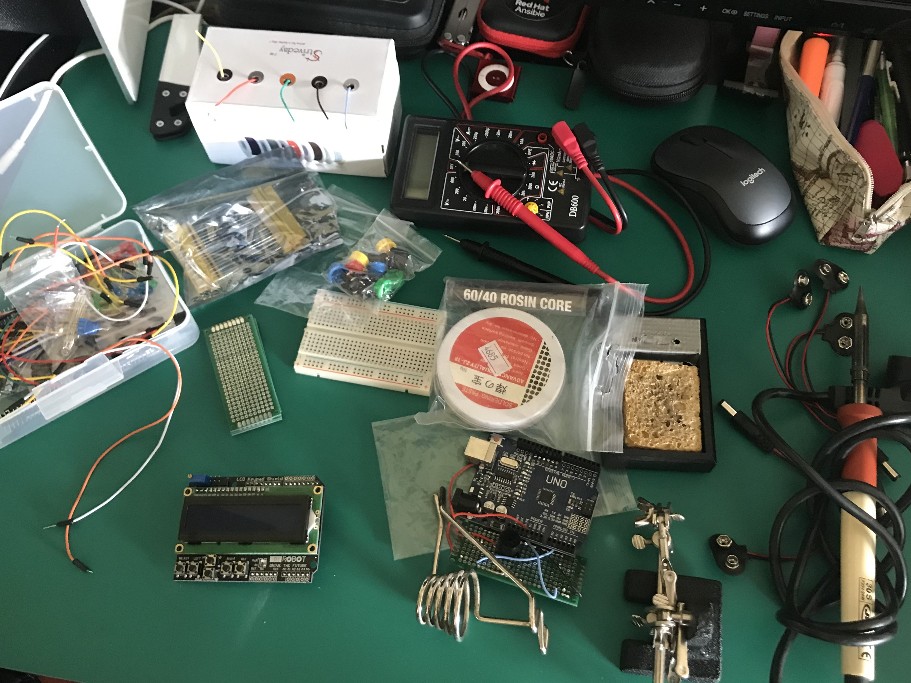
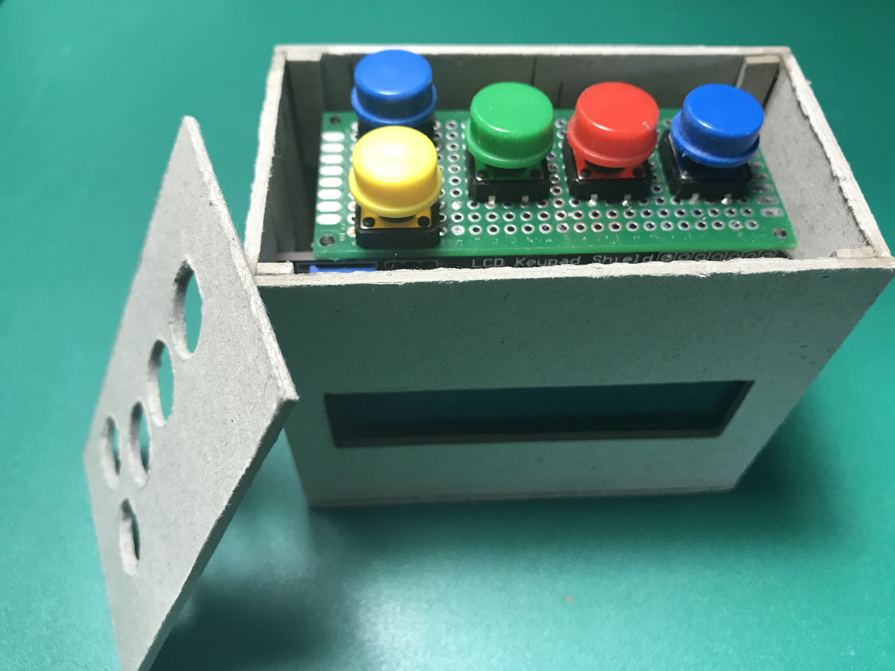

# Contador de Desastres Familiares

## Acerca de..

Este proyecto surge durante los meses de Marzo/Abrirl de 2020, en pleno confinamiento por COVID-19.
El aumento de desastres en casa es patente y se pierde la cuenta de platos, vasos y otros objetos del hogar rotos, así como golpes y moratones varios por los intentos de realizar físico dentro de casa.

Así que, usando el [Reloj de Guerra de Pacific Rim](https://pacificrim.fandom.com/wiki/War_Clock) como inspiración nos decidimos a utiliazar una placa Arduino UNO y un lcd que había por casa y así mitigar el aburrimiento durante un par de días.

## Materiales

- Arduino UNO
- LCD Keypad shield
- Protboard 10x24
- (x5) Pulsadores grandes para protoboard
- (x5) Tapas colores para Pulsadores
- Cables varios
- A falta de impresora 3D, cartón para hacer la caja (hemos usado cartón de 2mm de grosor)

## Ensamblaje

No tiene mucha ciencia, poner la shield en su sitio y presionar....
En este caso queríamos duplicarlo los botones de la shield en la parte superior de la caja y para eso hemos usado una protoboard sobre la que hemos soldado los pulsadores, los cables y puenteado los pulsadores de la shield.

## Codigo

Ver [ccdf.ino](https://github.com/antoniohernan/cddf/blob/master/cddf.ino)

## Futuras mejoras

La cuenta del reloj tiene a retrasarse, esto es, en 24h puede acumular unos 10 minutos de retraso.
Esto es porque el contador hace un delay de 1000 ms = 1 segundo en cada ejecución del LOOP, pero no tiene en cuenta el tiempo que tarda en procesar su lógica, por tanto, tarda 1000ms + el tiempo de ejecución, que acumula retraso.

Para solucionarlo tenemos pensados dos "workarounds"

**A)** En vez de hacer un delay de 1000 ms, parametrizar este valor para poder ir ajustanto a la baja (980 ms, etc.) hasta cuadrar con valores más aceptables de exactitud del transcurrido.
Este método es fácil, es fiable, pero no de ser una "ñapa" que no sa nunca un 95-100% de exactitud.

**B)** Cambiar el delay por un diferencial de valores obtenidos de la función millis() de manera que sepamos los milisegundos con los que entra a procesar y con los que sale, y los que faltan hasta los 1000 ms.
Esto nos dará una precisión mucho mayor, del 98-100%, si bien no es un cambio tan rápido ni fácil.
El problema es que la función millis() tiene la manía de sufrir un overflow cada 50 días aproximadamente, lo que será el máximo de tiempo que podríamos usar nuestra Arduino de contunio usando esta solución

## Caja

Y así queda con esta sencilla a la par que elegante caja de cartón:

